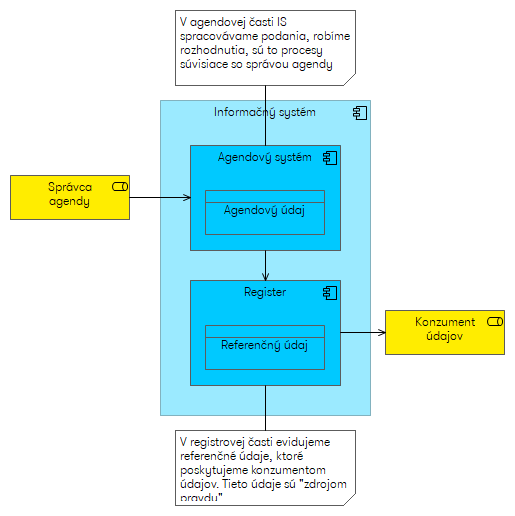
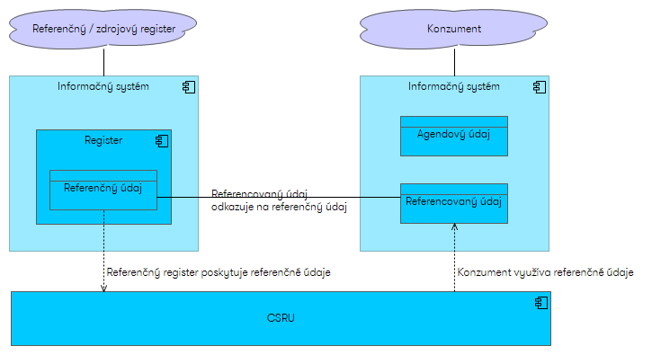

# Dáta v eGovernmente

## Referenčné a agendové údaje

Pojmy budeme ilustrovať na príklade zjednodušeného registra vozidiel. Ten obsahuje informácie o vozidle ako typ vozidla, výrobca, rok výroby, vlastník vozidla, farba a podobne.

Niektoré údaje sú veľmi zaujímavé pre iné orgány VS, prípadne verejnosť, napr. evidenčné číslo vozidla (EČV) alebo majiteľ vozidla. Cieľom je aby, tieto najdôležitejšie údaje registra boli vyhlásené za **referenčné údaje**, čo ostatným zaručuje, že sa na ne môžu spoľahnúť. Referenčné údaje môže charakterizovať tak, že sú to údaje, ktoré umožňujú identifikovať objekt (v tomto prípade vozidlo) a poskytujú o ňom najdôležitejšie údaje. Dá sa povedať, že hlavným zmyslom registra je evidovať a poskytovať referenčné údaje. 

V systéme sú evidovené aj iné údaje, napr. dátum evidencie vozidla, kto schválil evidenciu, akými stavmi prešla a podobne. Niežeby tieto údaje neboli dôležité, ale ich význam pre okolie je menší, tí čo sa nevenujú priamo tejto agende ich zväčša nepotrebujú. Aj pri týchto údajoch sa musí ISVS snažiť o ich maximálnu možnú kvalitu, ale nie sú v špeciálnom režime ako referenčné údaje. Všetky údaje evidované v IS, či už referenčné ale aj také, ktoré sú potrebné viac pre internú potrebu IS, sa nazývajú **agendové údaje**. 

## Referenčný register
Pri vozidle evidujeme aj informáciu o vlastníkovi vozidla, čo je fyzická alebo právnická osoba. Úlohou IS evidencie vozidiel nie je zaoberať sa evidenciou osôb, to je účelom Registra fyzických osôb alebo Registra právnických osôb. Preto IS evidencie vozidiel má odkazovať (referencovať) na osobu v RFO/RPO. Vlastník vozidla je teda **referencovaný údaj**. Register RFO/RPO hrá v tomto prípade rolu **referenčného registra** ktorý poskytuje svoje *referenčné údaje* o osobe. IS evidencie vozidiel je v roli konzumenta *referencovaných údajov*. 
Týmto zabezpečíme, že pri zmene priezviska, názvu spoločnosti prípadne ďalších referenčných údajov, sa zmena realizuje iba v referenčnom registri. Ostatné registre si tieto zmeny, o údajoch ktoré referencujú, preberú z referenčného registra. Samotná výmena údajov neprebieha priamou integráciou, ale cez CSRU. Povinnosť využívať referenčné údaje a získavať ich prostredníctvom CSRU je definovaná zákonom o eGovernmente.

Špeciálnym prípadom *referenčného registra* je **zdrojový register**. Príkladom je obchodný register, v ktorom sú evidované informácie o obchodných spoločnostiach (a iné). Aj keď je obchodný register primárnym miestom, kde sú tieto informácie evidované a manažované, posiela ich ďalej do registra právnických osôb. Až RPO je referenčný register, zhromažďuje informácie z viacerých zdrojových registrov, je zodpovedný za ich konsolidáciu a ich poskytovanie ako referenčných údajov. Z pohľadu konzumenta zdrojový register nie je zaujímavý, údaje sa získavajú z referenčného registra, za ktorým je zdrojový register „skrytý“. Čo sa týka kvality zdrojových údajov, je za ne zodpovedný zdrojový register, rovnako ako keby bol referenčným registrom.

Dá sa povedať, že IS VS vystupuje pri svojich dátach v niekoľkých roliach:
1.	Referenčný (alebo zdrojový) register – pre referenčné údaje, za ktoré zodpovedá
1.	Konzument – pre referencované údaje, ktoré musí preberá z iných registrov
1.	Agendový systém – pre údaje, ktoré nie sú ani referenčné ani referencované. Aj tieto údaje môže register poskytovať navonok, ale nie sú v špeciálnom režime referenčných údajov.

## URI - Jednotný referencovateľný identifikátor
Ak chceme odkazovať na nejaký objekt, napr. fyzickú osobu, právnickú osobu, vozidlo, ... , musíme vedieť povedať na čo odkazujeme, použiť výstižné označenie tohto objektu, ktoré ho dobre identifikuje. Toto označenie nazývame **jednotný referencovateľný identifikátor (URI - Uniform Resource Identifier)**. 
Dobrým príkladom URI je https://data.gov.sk/id/legal-subject/ico/00151742 , čo je identifikátor MFSR podľa ičo. URI teda nie je len samotné ičo (aj keď aj to by malo postačovať na identifikovanie subjektu). Samotné ičo je iba číslo, nie je z neho jasné že čo hovorí, musíme vedieť, že odkazuje na právnickú osobu pomocou ičo. Keď prídáme "obálku" aby vzniklo URI, tak zo samotného URI je jasné, že je to identifikátor právnickej osoby.

Od URI prirodzene očakávame: 
1. jednotnosť dosiahneme tým, že používame definovanú formu podobnú adresám na webe, presnejšie definované vo výnose o štandardoch isvs
1. identifikátor musí byť jednoznačný
1. musí byť dobre použiteľný, ľahko zdieľateľný
1. mal by byť stabilný, meniť sa iba vo výnimočných prípadoch

Napr. identifikátor FO , čo porušuje tretie pravidlo, pretože obsahuje rodné číslo, takže sa vlastne nedá zverejňovať a porušuje aj štvrté pravidlo, lebo obsahuje priezvisko, ktorého zmena sa dá (u žien) očakávať.

Používanie URI smeruje k Linked Data, ontológiám jednotlivých domén a sémantickému webu (web dát, nie web dokumentov) označovanému ako Web 3.0. 